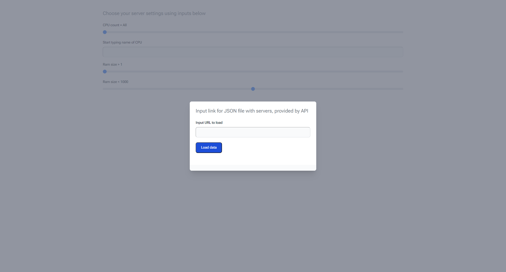

# freeds-selection

         

## Screenshots

## Deploy link

<https://thirdmadman.github.io/freeds-selection/>

## Description

This is SPA, tool for finding free servers with given parameters from list of servers given by Dcimanager 6 API.

To use this tool, you need to get a link to api-like server (it must have CORS policy headers), to get json data, which dcimgr provides.

This data can be received from dcimgr API, under Administrator access.

Link to dcimgr API with needed parameters

/api/dci/v3/server?orderby=owner_email%20asc&limit=0,400&where=(owner_email%20IS%20null)+AND+is_new%20EQ%20false

## Usage

Get link to json file and open app. Input link in field in shown popup and press "Load data" button.

After successful load, you will be provided with filter configs and table of servers.

Use sliders and input fields to filter table.

